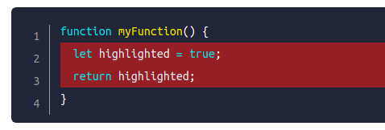
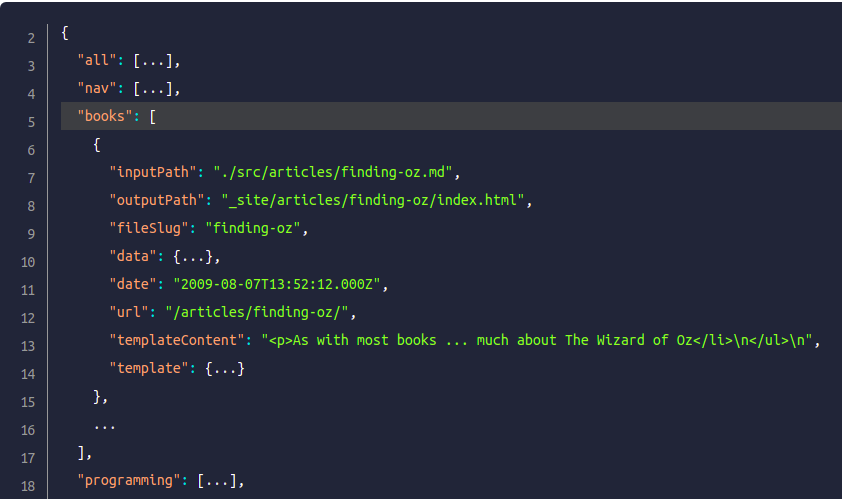

# @akumzy/eleventy-plugin-syntaxhighlight

This package simply adds line numbers support to Eleventy to official [@11ty/eleventy-plugin-syntaxhighligh](https://github.com/11ty/eleventy-plugin-syntaxhighlight)

## Installation

```sh
npm install --save-dev  @akumzy/eleventy-plugin-syntaxhighlight
```

## Configuration

```js
const syntaxHighlight = require('@akumzy/eleventy-plugin-syntaxhighlight')

module.exports = function(eleventyConfig) {
  eleventyConfig.addPlugin(syntaxHighlight,  { showLineNumbers: false, alwaysWrapLineHighlights:false })
}

```

## Markup Usage

````
```js#/1-2
function myFunction() {
  let highlighted = true;
  return highlighted;
}
```
````



<hr>

To start with a specific line number,
add the number enclosed with square brackets eg. [2] after the hash mark (`#`).

The line numbers for this code fence
will start at 2 plus the highlighting syntax.

````
```json#[2]2,3
{
  "all": [...],
  "nav": [...],
  "books": [
    {
      "inputPath": "./src/articles/finding-oz.md",
      "outputPath": "_site/articles/finding-oz/index.html",
      "fileSlug": "finding-oz",
      "data": {...},
      "date": "2009-08-07T13:52:12.000Z",
      "url": "/articles/finding-oz/",
      "templateContent": "<p>As with most books ... much about The Wizard of Oz</li>\n</ul>\n",
      "template": {...}
    },
    ...
  ],
  "programming": [...],
}
```
````



## Credits

- Philip Borenstein (@pborenstein): [eleventy-md-syntax-highlight](https://github.com/pborenstein/eleventy-md-syntax-highlight)

- [@11ty/eleventy-plugin-syntaxhighligh](https://github.com/11ty/eleventy-plugin-syntaxhighlight)
